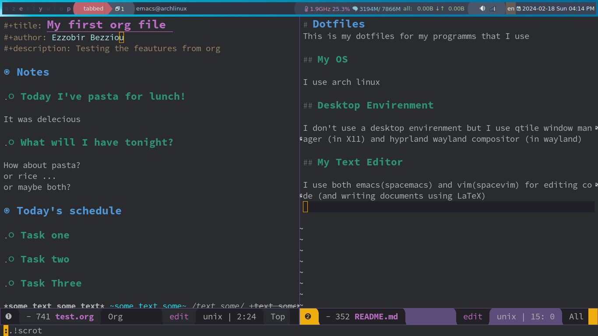

# Dotfiles
This is my dotfiles for my programms that I use

## My OS

I use [arch linux](www.archlinux.org).
Other Distribution I Love: [Void Linux](www.voidlinux.org) and [Gnu Guix System](guix.gnu.org)

## Desktop Envirenment

I don't use a desktop envirenment but I use [i3](www.i3wm.org) window manager (in X11) and [sway](www.swaywm.org) wayland compositor (in wayland)

## My Text Editor

I use both emacs(spacemacs) and vim(spacevim) for editing code (and writing documents using LaTeX)

## Screenshots

## Other programms I use

- mpv (video player)
- zathura (pdf viewer)
- firefox (browser)
- feh (image viewer)
