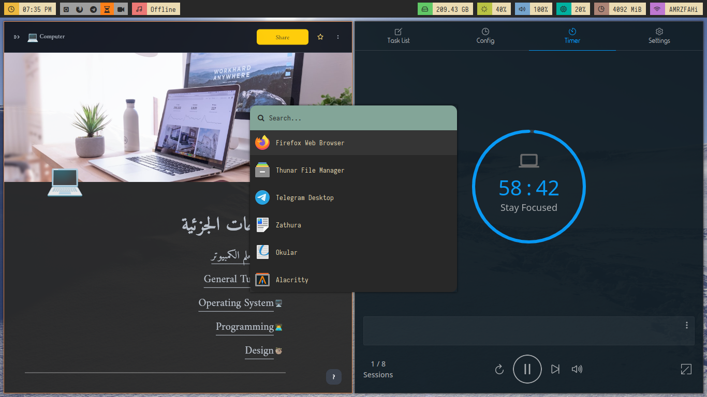
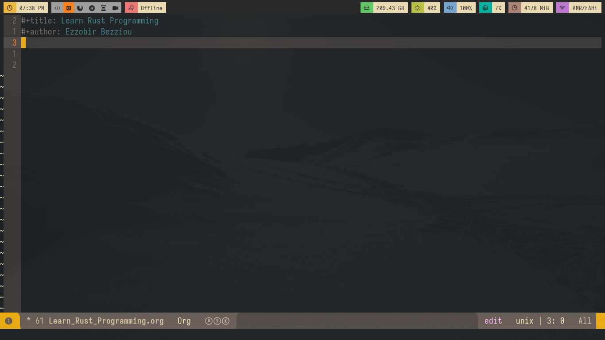

# Dotfiles
This is my dotfiles for my programms that I use

## My OS

I use [Arch Linux](https://archlinux.org/).

Other Distribution I Love: [Void Linux](https://voidlinux.org/) and [Gnu Guix System](https://guix.gnu.org/).

## Desktop Envirenment

I don't use a desktop envirenment but I use [i3](https://i3wm.org/) window manager (on X11) with [polybar](https://github.com/polybar/polybar) and [sway](https://swaywm.org/) wayland compositor (on wayland) with [waybar](https://github.com/Alexays/Waybar).

## My Text Editor

I use both emacs(spacemacs) and vim(spacevim) for editing code (and writing documents using LaTeX)

## Screenshots

- here polybar on the top, appflowy at left and pomatez at right and rofi pop up in the middle of the screen. 

- here i3 wm running spacemacs

## Other programms I use

- firefox and qutebrowser (browser)
- neomutt (email client)
- mpv (video player)
- mpd (audio player)
- feh and nsxiv (image viewer)
- zathura (pdf viewer)

